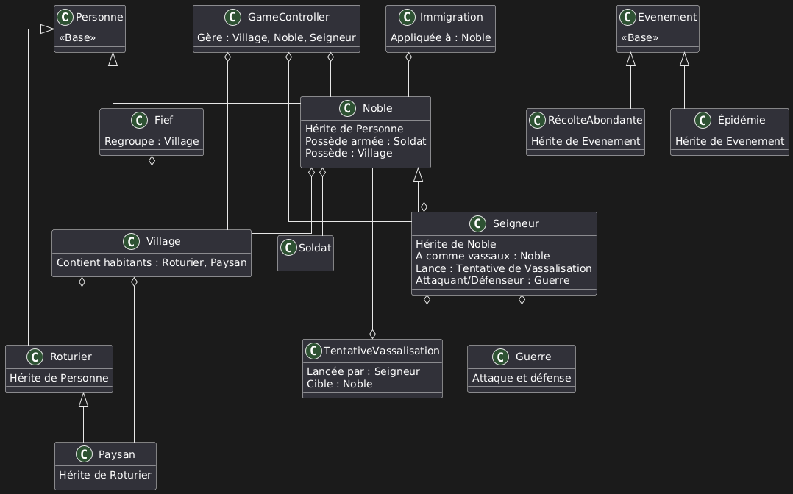

# Compte Rendu du Projet "La Guerre des Frontières"

## Introduction

Ce document présente l'architecture du projet "La Guerre des Frontières" en suivant une approche basée sur le modèle MVC. Le projet consiste en un jeu médiéval où les interactions des personnages (roturiers, nobles, seigneurs) influencent les événements dans un univers simulé.

## Objectifs

Créer une architecture modulaire et extensible permettant une gestion claire des entités et des interactions.

Faciliter la compréhension et la maintenance du code en définissant des relations explicites entre les classes.

Représenter graphiquement la structure du projet pour une meilleure communication des concepts.

## Structure du Projet

- Organisation des Classes

    Voici les principales classes du projet :

     - `Personne` : Classe de base représentant un individu.

     - `Roturier` : Hérite de Personne, représentant une classe sociale plus modeste.

     - `Paysan` : Hérite de Roturier, un roturier spécialisé dans l'agriculture.

     - `Noble` : Hérite de Personne, capable de posséder des armées et des villages.

     - `Seigneur` : Hérite de Noble, chef suprême possédant des vassaux.

     - `Soldat` : Classe indépendante représentant une unité militaire.

     - `Village` : Regroupe des habitants et appartient à un noble.

     - `Fief` : Regroupe plusieurs villages.

     - `Evenement` : Classe de base pour modéliser les événements comme les récoltes abondantes ou les épidémies.

     - `GameController` : Classe centrale gérant les interactions entre les différentes entités du jeu.

- Relations entre les Classes :
    - Les relations entre ces classes sont définies de manière hiérarchique ou par composition. Les nobles, par exemple, possèdent des villages, et les seigneurs peuvent tenter de vassaliser d'autres nobles.

 - Diagramme UML
    - Le diagramme UML ci-dessous illustre les relations entre les différentes classes du projet :
        

## Méthodologie

Étapes Réalisées :

 - Analyse des besoins : Identification des entités principales et des interactions nécessaires.

 - Modélisation UML : Création d’un diagramme clair représentant l'architecture.

 - Implémentation des classes : Développement des classes en Python selon le diagramme défini.

 - Documentation : Rédaction de ce compte rendu.

Outils Utilisés : 

 - `Python` : Langage principal pour le développement.

 - `PlantUML` : Description graphique de l’architecture du projet.

## Conclusion

Le projet "Jeu Interface" offre une structure claire et modulable, facilitant l'ajout de nouvelles fonctionnalités. Le diagramme UML permet de visualiser efficacement les relations complexes entre les différentes entités. Ce compte rendu servira de référence pour toute évolution du projet.

## Annexes

Fichier PlantUML (.puml) : Code source pour le diagramme UML.